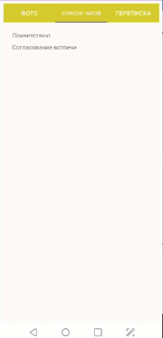

# **Задание**

В рамках тестового задания **ваша задача разработать мини-приложение с тремя  экранами,** на первом экране должно воспроизводится видео с фронтальной камеры, на втором экране должен быть чат.

1. Экран Селфи** - При входе появляется первый экран, изображение на который подается с фронтальной камеры в реальном времени. Для примера скриншот аналогичного экрана из приложения. Что должно быть на экране
2. Экран списка чатов** -  на страницу можно добавить один открытый чат (как на примере) , при тапе на который пользователь должен переходить вутрь самого чата 
3. Экран чата**  - нужно реализовать возможность оправки сообщения. В ответ на любое сообщение должно приходить "Hello!"

Camera fragment

Chat fragment

